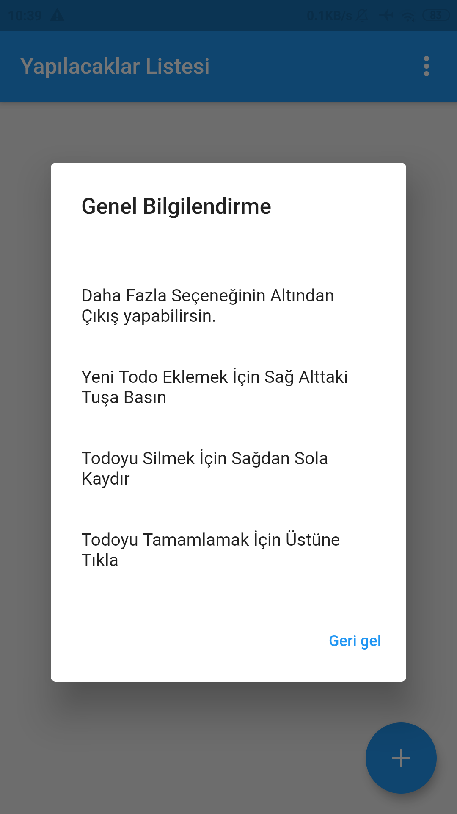
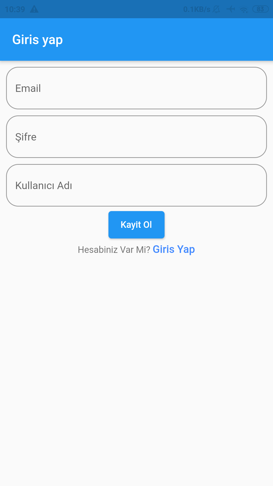

# Açıklama
Amazon Web Servislerinin Flutter ile kullanıldığı basit bir proje. Önceliğim öğrenip uygulamak olduğu için tasarım kısmıyla uğraşmadım dolayısıyla tasarım açısından daha iyi olabilir.

## Görseller
Uygulama içinden ekran görüntüleri

